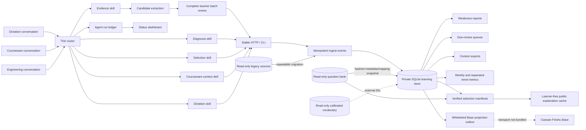

# Cassian Atlas architecture

## Decision summary

The system uses a thin deterministic router in front of independent specialist skills and an event-ingestion boundary in front of a normalized SQLite learning-record store. Other conversations submit a task once; the router returns the smallest ordered skill chain. Specialists send versioned JSON and never write SQL or migrations. Attempt facts are immutable. Corrections append a replacement import and void the old event while retaining audit evidence.

Model extraction has a stricter pre-ingestion boundary. Provider outputs are immutable candidates, every item appears in one compact batch review, and only a complete set of terminal teacher decisions can be committed atomically as attempts and evaluations. Unconfirmed candidates never join the learning-fact tables, so they cannot change mastery, error evidence, or retest scheduling.

External question and vocabulary databases remain read-only. `external_references` links used items to stable IDs. `content_items` keeps only the prompt/answer snapshot needed to interpret a historical attempt even if an external source later changes.

## Components

## Entity relationships

```mermaid
erDiagram
    STUDENTS ||--o{ LEARNING_SESSIONS : participates
    STUDENTS ||--o{ STUDENT_SUBJECTS : enrolls
    SUBJECTS ||--o{ STUDENT_SUBJECTS : enables
    SUBJECTS ||--o{ CONTENT_ITEMS : scopes
    LEARNING_SESSIONS ||--o{ ATTEMPTS : contains
    LEARNING_SESSIONS ||--o{ SESSION_OBSERVATIONS : records
    LEARNING_SESSIONS ||--o{ SESSION_PROGRESS : tracks
    LEARNING_SESSIONS ||--o| SESSION_ASSESSMENTS : classifies
    ARTIFACTS ||--o{ LEARNING_SESSIONS : supports
    CONTENT_ITEMS ||--o{ ATTEMPTS : attempted_as
    CONTENT_ITEMS ||--o{ EXTERNAL_REFERENCES : points_to
    CONTENT_ITEMS ||--o{ ITEM_KNOWLEDGE_MAP : tagged_by
    KNOWLEDGE_POINTS ||--o{ ITEM_KNOWLEDGE_MAP : classifies
    KNOWLEDGE_POINTS ||--o{ KNOWLEDGE_POINTS : parent_of
    SOURCE_SNAPSHOTS ||--o{ GRAMMAR_PASSAGE_CATALOG : versions
    SOURCE_SNAPSHOTS ||--o{ GRAMMAR_QUESTION_CATALOG : versions
    GRAMMAR_PASSAGE_CATALOG ||--o{ GRAMMAR_QUESTION_CATALOG : contains
    GRAMMAR_QUESTION_CATALOG ||--o{ QUESTION_KNOWLEDGE_MAP : tagged_by
    KNOWLEDGE_POINTS ||--o{ QUESTION_KNOWLEDGE_MAP : classifies
    ATTEMPTS ||--o{ EVALUATIONS : revised_by
    ATTEMPTS ||--o{ ATTEMPT_ERROR_MAP : exhibits
    ERROR_TYPES ||--o{ ATTEMPT_ERROR_MAP : normalizes
    ERROR_TYPES ||--o{ ERROR_TYPE_ALIASES : accepts
    STUDENTS ||--o{ REVIEW_STATE : owns
    CONTENT_ITEMS ||--o{ REVIEW_STATE : scheduled
    STUDENTS ||--o{ REVIEW_TASKS : receives
    CONTENT_ITEMS ||--o{ REVIEW_TASKS : targets
    INGEST_EVENTS ||--o{ ATTEMPTS : creates
    INGEST_EVENTS ||--o{ INGEST_EVENT_ROWS : audits
    INGEST_EVENTS ||--o{ LEGACY_RECORDS : preserves
    STUDENTS ||--o{ AGENT_RUNS : owns
    SUBJECTS ||--o{ AGENT_RUNS : scopes
    AGENT_RUNS ||--o{ AGENT_RUN_EVENTS : records
    STUDENTS ||--o{ ARTIFACT_GENERATION_RUNS : owns
    SUBJECTS ||--o{ ARTIFACT_GENERATION_RUNS : scopes
    ARTIFACTS |o--o{ ARTIFACT_GENERATION_RUNS : may_be_output_of
    STUDENTS ||--o{ EXTRACTION_BATCHES : owns
    LEARNING_SESSIONS ||--o{ EXTRACTION_BATCHES : scopes
    EXTRACTION_BATCHES ||--o{ EXTRACTION_ITEMS : contains
    EXTRACTION_ITEMS ||--o{ EXTRACTION_PROVIDER_RESULTS : receives
    EXTRACTION_ITEMS ||--o{ EXTRACTION_CONFIRMATION_DECISIONS : reviewed_by
    EXTRACTION_ITEMS ||--o| EXTRACTION_COMMIT_LINKS : may_commit_as
    ATTEMPTS ||--o| EXTRACTION_COMMIT_LINKS : traces_to
    STUDENTS ||--o{ BASE_PROJECTION_RUNS : owns
    BASE_PROJECTION_RUNS ||--o{ BASE_PROJECTION_OUTBOX : stages
    BASE_PROJECTION_OUTBOX ||--o{ BASE_PROJECTION_DELIVERY_ATTEMPTS : audits
    BASE_PROJECTION_OUTBOX ||--o| BASE_PROJECTION_STATE : publishes
    STUDENTS ||--o{ QUESTION_SELECTION_MANIFESTS : owns
    QUESTION_SELECTION_MANIFESTS ||--o{ QUESTION_SELECTION_GROUPS : contains
    QUESTION_SELECTION_GROUPS ||--o{ QUESTION_SELECTION_ITEMS : contains
    QUESTION_SELECTION_MANIFESTS ||--o{ QUESTION_SELECTION_EXCLUSIONS : explains
```

## Orchestration boundary

`POST /api/agent/route` performs deterministic intent matching and optionally creates one idempotent `agent_runs` record. The returned `steps` reference independently installed skills. The router only classifies, orders, and consolidates; it does not perform grading, diagnosis, set-cover, or report calculations.

Specialists append start, material progress, and one terminal event through `/api/agent/runs/{run_id}/events`. These rows are operational metadata. They do not join attempts, evaluations, mastery, or review queues and therefore cannot change learner metrics. Independent steps may run in parallel when the host supports subagents; evidence-dependent steps remain sequential.

## Consistency model

- `PRAGMA foreign_keys=ON`, `journal_mode=WAL`, `busy_timeout=10000`, and transactional writes are set on every writable connection.
- `ingest_events.idempotency_key` and `attempts.event_id` are globally unique.
- A payload replay is accepted only when its canonical SHA-256 matches the first import.
- Extraction assets, items, provider results, decisions, and commit links are append-only audit evidence. A committed batch is immutable.
- Every extraction item requires a current terminal teacher decision. `pending_review` and `needs_check` block the entire batch; `not_captured` and `rejected_alignment` create no formal attempt.
- Cold-start `R1`, `R2`, and `R3` items require successful independent `codex` and `doubao` results before a committable decision. `R0` deterministic capture may remain single-provider; `R4` is manual or excluded.
- The deployment is a trusted local-operator boundary. Provider and teacher actor fields are append-only provenance claims, not cryptographic authentication; write endpoints must not be exposed to untrusted callers, and the confirmation skill must derive decisions only from an explicit teacher response.
- The extraction commit rechecks the review version, imports all committable rows inside the owning transaction, stores one-to-one lineage, and reads the rows back before marking the batch committed.
- One current evaluation is enforced by a partial unique index.
- One open review task per student/item is enforced by a partial unique index.
- Automated imports never overwrite an existing item snapshot or manual review-state override.
- A `model_suggested` question/item mapping cannot be `source_checked` or `verified`; manual promotion is an explicit later action.
- `not_captured` attempts cannot carry an active specific error-cause mapping. Historical violations are retained as voided/rejected audit evidence.
- `agent_runs.idempotency_key` prevents duplicate dashboard tasks; every run begins with an append-only `planned` event and terminal timestamps must match terminal status.
- `agent_run_events.idempotency_key` is globally unique; exact event retries are safe and conflicting reuse is rejected.
- Learner ownership for linked sessions, attempts, reviews, artifacts, and generation outputs is enforced in both application code and SQLite triggers.
- Applied migrations retain the packaged SQL checksum. Ordinary commands, including server start, fail closed unless schema status is `ready`; `opentutor upgrade` makes a checked backup and applies packaged pending migrations, while checksum mismatches or unknown applied versions require investigation.
- Artifact generation records bind an immutable source snapshot to the owning learner. New learning evidence marks prior completed outputs stale without deleting them.
- Base projection payloads are flat, projection-specific allowlists. Question content, answers, explanations, OCR/model output, learner display names, tokens, URLs, and private paths cannot enter the outbox.
- A successful Base delivery must cite the current outbox attempt and return a readback SHA-256 equal to the staged payload; a remote-record ID change is rejected as drift.
- Finalized question-selection manifests are immutable, learner-owned, source-snapshot-bound audit records. Public explanation rows deliberately have no learner, attempt, answer-submission, or diagnosis relation.

## Candidate extraction and teacher confirmation

Migration `012_extraction_confirmation.sql` implements the only bridge from model-extracted answers to formal evidence. `extraction_batches` owns the learner/session scope and optimistic `review_version`; assets and items bind image hashes and attempt templates without accepting an answer. Each `extraction_provider_results` row preserves one provider's raw and normalized transcription, capture state, uncertainty, provenance hashes, and failure state. Later submissions append rows rather than editing earlier evidence.

The review service computes exact, ignorable, blank, alignment, uncertainty, or content conflicts and emits character-level diff spans when candidates disagree. Every item remains visible: ordinary matches may be accepted with a compact batch action, but silence and partial review are never acceptance. Standard answers are hidden from the extraction comparison.

The current cold-start policy is deliberately conservative. Codex and Doubao first-round requests use the same source crop, run independently (and may run concurrently), and never receive the standard answer or the other provider's output:

- `R0`: deterministic, clearly structured capture may use one provider, followed by teacher confirmation.
- `R1`: all cold-start capture, including ordinary clear rows, requires both Codex and Doubao until a future persisted learner-and-question-type calibration gate exists.
- `R2`: handwriting, OCR uncertainty, blanks, and alignment-sensitive work require Codex and Doubao.
- `R3`: translation and writing require Codex and Doubao plus explicit teacher adjudication of any difference.
- `R4`: unusable or unsafe evidence is handled manually, marked `not_captured`, or rejected for alignment.

Terminal confirmation actions are `human_confirmed`, `human_corrected`, `confirmed_blank`, `not_captured`, and `rejected_alignment`. Only the first three create an attempt/evaluation, and a batch with only exclusions has no formal fact to commit. The atomic commit writes committable facts through the ordinary idempotent ingestion layer and records `extraction_commit_links`; any missing decision, missing provider, stale review version, grading failure, or readback mismatch rolls back the batch.

The Doubao adapter is transport-injected and has no default network client. Missing environment-only credentials return `unconfigured` with zero calls. Outbound requests contain the minimum image crop and locator, never an answer key, another provider's result, learner name, or private path; provider failures remain review-visible candidates, not facts.

## Operational Base projection boundary

Migration `013_feishu_base_projection.sql` provides a local, transport-independent projection ledger. The seven allowed views are `student_overview`, `period_metrics`, `knowledge_performance`, `retest_summary`, `data_quality`, `generation_runs`, and `teacher_policy_correction_inbox`. Each has an exact flat field whitelist, stable upsert key, data-as-of time, metric version, sample size, and one of `FRESH`, `DELAYED`, `STALE`, or `FAILED`.

`base_projection_runs` and `base_projection_outbox` stage learner-scoped payloads idempotently. `base_projection_delivery_attempts` records sanitized success/retry/permanent-failure receipts; `base_projection_state` advances only after an audited successful readback whose payload hash matches the staged record. Unchanged hashes are skipped without a transport call, retry state remains explicit, and published remote-record IDs cannot drift silently.

Target validation fails closed unless the local configuration names `Cassian Learning Lab | 学习工作室`, app `Cassian Learning Ops`, CLI profile `cassian-learning-hub`, identity `user`, and an exact same-tenant folder/Base pair for the requested `STU-*` learner. Validation returns a fingerprint rather than tokens or URLs. This release does not bundle or invoke a live Feishu transport; staging and receipt bookkeeping alone do not authorize a cloud write.

## Verified selection manifests and public explanation reuse

Migration `014_verified_selection_and_explanations.sql` adds a stricter selection audit than the legacy weighted passage helper. The selector opens the configured question bank read-only and pins its SHA-256 snapshot. Candidates must be real source records with `source_checked` or `verified` questions, standard answers, source locators, and all required options. Passage-based work expands to the complete verified sibling set; one requested blank can never detach from its passage.

Before finalization, the selector compares stable IDs and content hashes, the question-bank duplicate map, normalized near-duplicate similarity, explicit recent IDs, prior learner attempts, and recent finalized manifests. Current-manifest duplicates are always excluded. An exact historical retest is allowed only in correction mode with the explicit retest policy; every selection or exclusion retains reason codes, evidence references, knowledge coverage, and duplicate details in the immutable manifest.

`public_question_explanations` is a separate reusable content cache, not learner evidence. Its key hashes the source snapshot, question, standard answer, knowledge mapping, rubric, policy, and schema identities. Explanation content rejects learner/attempt/diagnosis fields and private path patterns. Only `source_checked` and `teacher_confirmed` rows are returned as reusable; changed identities make older content stale rather than mutating it.

## Grammar catalog and legacy complete-passage selection

`knowledge sync` hashes the read-only source and snapshots only source-checked grammar metadata. It keeps stable question/passage/source IDs, availability flags, raw and normalized legacy tags, and normalized mappings. Stems and answer text remain in the external source. Reversible Latin-1/GBK tag corruption is repaired only in normalized fields; raw values remain auditable.

Legacy tag mappings can be confirmed source coverage. Rule and model outputs remain suggestions. The weighted greedy set-cover selector scores explicit targets plus recency-weighted recent errors, discounts suggestions, and admits only complete source-checked passages. It never returns an isolated blank.

## Measurement model

The attempt/evaluation pair is the primary performance fact. `session_assessments` adds a total score, duration, environment and reporting classification when those values are available; its absence does not make classroom evidence unreal. Passage and session summaries are derived from the active current evaluations.

`session_assessments` classifies a session as lesson, topic quiz, biweekly mixed test, full exam, dictation, homework, or other. Weekly metrics expose denominators for accuracy, blank rate, retest recovery, and knowledge-point performance. Raw score series are keyed by assessment kind, reporting series, and maximum score; different totals are not joined. Schedule compliance is calculated separately from observed outcomes.

The evidence policy assigns larger weights to controlled offline closed mixed tests and full papers so they can calibrate ordinary practice. Reading knowledge mappings describe what an item tests. `attempt_error_map` describes why one student attempt failed; agent additions are suggestions and cannot overwrite verified teacher evidence. A not-captured answer cannot have an active specific error cause.

## Weakness model (`weakness-v1`)

The report groups active, currently evaluated attempts by leaf knowledge point and produces 7-day, requested-window, and all-time views. Its weighted score uses:

- 45% error rate;
- 20% recency;
- 15% consecutive errors;
- 10% latest review penalty;
- 5% difficulty;
- 5% active-recall exposure;
- a sample-size attenuation factor.

The score orders investigation; it does not itself establish a diagnosis. The confidence gate separately prevents one-question conclusions from being labeled stable.

## Privacy and repository boundary

The repository contains no private configuration. Runtime discovery uses global `--config`, `OPEN_TUTOR_CONFIG`, or the private default config, with the legacy environment variables as compatibility fallbacks. The `.gitignore` excludes common database, backup, export, inbox, document, image, and audio formats.

Multiple learners share one local schema while every learning fact retains `student_id`. Subjects are registered separately; every content item carries `subject_code`. The English adapter may read an external question bank, while generic subject workspaces can record lessons, assignments, and assessments without bundling source content.

## Known limitations

- `simple-v1` is not an FSRS implementation. The schema can retain stability/difficulty fields for a future adapter.
- Knowledge mapping imported from old free-text tags is deterministic but still marked by its evidence source.
- Fine-grained rule mappings are provisional until manually reviewed; coverage reports separate confirmed and suggested counts.
- Cold-start `R1` extraction remains dual-provider until a persisted learner/question-type calibration registry is implemented.
- Feishu projection delivery is intentionally not bundled; only the local whitelist, outbox, receipt, and readback state machine ship in 0.5.0.
- The MVP supports multiple learner profiles on one trusted local installation, but does not provide internet-facing identity, authentication, or authorization.
- Timestamps are stored as ISO-8601 text; producers should include a timezone offset.
