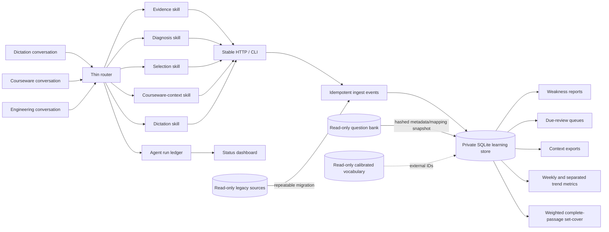

# Architecture

## Decision summary

The system uses a thin deterministic router in front of independent specialist skills and an event-ingestion boundary in front of a normalized SQLite learning-record store. Other conversations submit a task once; the router returns the smallest ordered skill chain. Specialists send versioned JSON and never write SQL or migrations. Attempt facts are immutable. Corrections append a replacement import and void the old event while retaining audit evidence.

External question and vocabulary databases remain read-only. `external_references` links used items to stable IDs. `content_items` keeps only the prompt/answer snapshot needed to interpret a historical attempt even if an external source later changes.

## Components

## Entity relationships

```mermaid
erDiagram
    STUDENTS ||--o{ LEARNING_SESSIONS : participates
    STUDENTS ||--o{ STUDENT_SUBJECTS : enrolls
    SUBJECTS ||--o{ STUDENT_SUBJECTS : enables
    SUBJECTS ||--o{ CONTENT_ITEMS : scopes
    LEARNING_SESSIONS ||--o{ ATTEMPTS : contains
    LEARNING_SESSIONS ||--o{ SESSION_OBSERVATIONS : records
    LEARNING_SESSIONS ||--o{ SESSION_PROGRESS : tracks
    LEARNING_SESSIONS ||--o| SESSION_ASSESSMENTS : classifies
    ARTIFACTS ||--o{ LEARNING_SESSIONS : supports
    CONTENT_ITEMS ||--o{ ATTEMPTS : attempted_as
    CONTENT_ITEMS ||--o{ EXTERNAL_REFERENCES : points_to
    CONTENT_ITEMS ||--o{ ITEM_KNOWLEDGE_MAP : tagged_by
    KNOWLEDGE_POINTS ||--o{ ITEM_KNOWLEDGE_MAP : classifies
    KNOWLEDGE_POINTS ||--o{ KNOWLEDGE_POINTS : parent_of
    SOURCE_SNAPSHOTS ||--o{ GRAMMAR_PASSAGE_CATALOG : versions
    SOURCE_SNAPSHOTS ||--o{ GRAMMAR_QUESTION_CATALOG : versions
    GRAMMAR_PASSAGE_CATALOG ||--o{ GRAMMAR_QUESTION_CATALOG : contains
    GRAMMAR_QUESTION_CATALOG ||--o{ QUESTION_KNOWLEDGE_MAP : tagged_by
    KNOWLEDGE_POINTS ||--o{ QUESTION_KNOWLEDGE_MAP : classifies
    ATTEMPTS ||--o{ EVALUATIONS : revised_by
    ATTEMPTS ||--o{ ATTEMPT_ERROR_MAP : exhibits
    ERROR_TYPES ||--o{ ATTEMPT_ERROR_MAP : normalizes
    ERROR_TYPES ||--o{ ERROR_TYPE_ALIASES : accepts
    STUDENTS ||--o{ REVIEW_STATE : owns
    CONTENT_ITEMS ||--o{ REVIEW_STATE : scheduled
    STUDENTS ||--o{ REVIEW_TASKS : receives
    CONTENT_ITEMS ||--o{ REVIEW_TASKS : targets
    INGEST_EVENTS ||--o{ ATTEMPTS : creates
    INGEST_EVENTS ||--o{ INGEST_EVENT_ROWS : audits
    INGEST_EVENTS ||--o{ LEGACY_RECORDS : preserves
    STUDENTS ||--o{ AGENT_RUNS : owns
    SUBJECTS ||--o{ AGENT_RUNS : scopes
    AGENT_RUNS ||--o{ AGENT_RUN_EVENTS : records
    STUDENTS ||--o{ ARTIFACT_GENERATION_RUNS : owns
    SUBJECTS ||--o{ ARTIFACT_GENERATION_RUNS : scopes
    ARTIFACTS |o--o{ ARTIFACT_GENERATION_RUNS : may_be_output_of
```

## Orchestration boundary

`POST /api/agent/route` performs deterministic intent matching and optionally creates one idempotent `agent_runs` record. The returned `steps` reference independently installed skills. The router only classifies, orders, and consolidates; it does not perform grading, diagnosis, set-cover, or report calculations.

Specialists append start, material progress, and one terminal event through `/api/agent/runs/{run_id}/events`. These rows are operational metadata. They do not join attempts, evaluations, mastery, or review queues and therefore cannot change learner metrics. Independent steps may run in parallel when the host supports subagents; evidence-dependent steps remain sequential.

## Consistency model

- `PRAGMA foreign_keys=ON`, `journal_mode=WAL`, `busy_timeout=10000`, and transactional writes are set on every writable connection.
- `ingest_events.idempotency_key` and `attempts.event_id` are globally unique.
- A payload replay is accepted only when its canonical SHA-256 matches the first import.
- One current evaluation is enforced by a partial unique index.
- One open review task per student/item is enforced by a partial unique index.
- Automated imports never overwrite an existing item snapshot or manual review-state override.
- A `model_suggested` question/item mapping cannot be `source_checked` or `verified`; manual promotion is an explicit later action.
- `not_captured` attempts cannot carry an active specific error-cause mapping. Historical violations are retained as voided/rejected audit evidence.
- `agent_runs.idempotency_key` prevents duplicate dashboard tasks; every run begins with an append-only `planned` event and terminal timestamps must match terminal status.
- `agent_run_events.idempotency_key` is globally unique; exact event retries are safe and conflicting reuse is rejected.
- Learner ownership for linked sessions, attempts, reviews, artifacts, and generation outputs is enforced in both application code and SQLite triggers.
- Applied migrations retain the packaged SQL checksum. Ordinary commands, including server start, fail closed while a migration is pending; `opentutor upgrade` makes a checked backup and applies migrations explicitly.
- Artifact generation records bind an immutable source snapshot to the owning learner. New learning evidence marks prior completed outputs stale without deleting them.

## Grammar catalog and selection

`knowledge sync` hashes the read-only source and snapshots only source-checked grammar metadata. It keeps stable question/passage/source IDs, availability flags, raw and normalized legacy tags, and normalized mappings. Stems and answer text remain in the external source. Reversible Latin-1/GBK tag corruption is repaired only in normalized fields; raw values remain auditable.

Legacy tag mappings can be confirmed source coverage. Rule and model outputs remain suggestions. The weighted greedy set-cover selector scores explicit targets plus recency-weighted recent errors, discounts suggestions, and admits only complete source-checked passages. It never returns an isolated blank.

## Measurement model

The attempt/evaluation pair is the primary performance fact. `session_assessments` adds a total score, duration, environment and reporting classification when those values are available; its absence does not make classroom evidence unreal. Passage and session summaries are derived from the active current evaluations.

`session_assessments` classifies a session as lesson, topic quiz, biweekly mixed test, full exam, dictation, homework, or other. Weekly metrics expose denominators for accuracy, blank rate, retest recovery, and knowledge-point performance. Raw score series are keyed by assessment kind, reporting series, and maximum score; different totals are not joined. Schedule compliance is calculated separately from observed outcomes.

The evidence policy assigns larger weights to controlled offline closed mixed tests and full papers so they can calibrate ordinary practice. Reading knowledge mappings describe what an item tests. `attempt_error_map` describes why one student attempt failed; agent additions are suggestions and cannot overwrite verified teacher evidence. A not-captured answer cannot have an active specific error cause.

## Weakness model (`weakness-v1`)

The report groups active, currently evaluated attempts by leaf knowledge point and produces 7-day, requested-window, and all-time views. Its weighted score uses:

- 45% error rate;
- 20% recency;
- 15% consecutive errors;
- 10% latest review penalty;
- 5% difficulty;
- 5% active-recall exposure;
- a sample-size attenuation factor.

The score orders investigation; it does not itself establish a diagnosis. The confidence gate separately prevents one-question conclusions from being labeled stable.

## Privacy and repository boundary

The repository contains no private configuration. Runtime discovery uses global `--config`, `OPEN_TUTOR_CONFIG`, or the private default config, with the legacy environment variables as compatibility fallbacks. The `.gitignore` excludes common database, backup, export, inbox, document, image, and audio formats.

Multiple learners share one local schema while every learning fact retains `student_id`. Subjects are registered separately; every content item carries `subject_code`. The English adapter may read an external question bank, while generic subject workspaces can record lessons, assignments, and assessments without bundling source content.

## Known limitations

- `simple-v1` is not an FSRS implementation. The schema can retain stability/difficulty fields for a future adapter.
- Knowledge mapping imported from old free-text tags is deterministic but still marked by its evidence source.
- Fine-grained rule mappings are provisional until manually reviewed; coverage reports separate confirmed and suggested counts.
- The MVP supports multiple learner profiles on one trusted local installation, but does not provide internet-facing identity, authentication, or authorization.
- Timestamps are stored as ISO-8601 text; producers should include a timezone offset.
