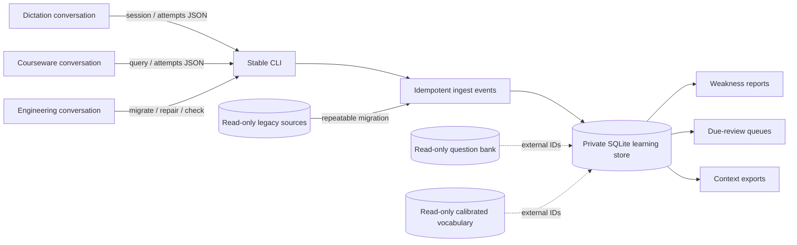
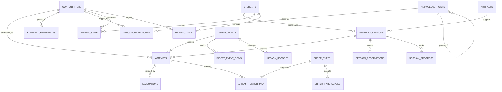

# Architecture

## Decision summary

The system uses an event-ingestion boundary in front of a normalized SQLite learning-record store. Other conversations send versioned JSON; they never write SQL or migrations. Attempt facts are immutable. Corrections append a replacement import and void the old event while retaining audit evidence.

External question and vocabulary databases remain read-only. `external_references` links used items to stable IDs. `content_items` keeps only the prompt/answer snapshot needed to interpret a historical attempt even if an external source later changes.

## Components

## Entity relationships

## Consistency model

- `PRAGMA foreign_keys=ON`, `journal_mode=WAL`, `busy_timeout=10000`, and transactional writes are set on every writable connection.
- `ingest_events.idempotency_key` and `attempts.event_id` are globally unique.
- A payload replay is accepted only when its canonical SHA-256 matches the first import.
- One current evaluation is enforced by a partial unique index.
- One open review task per student/item is enforced by a partial unique index.
- Automated imports never overwrite an existing item snapshot or manual review-state override.

## Weakness model (`weakness-v1`)

The report groups active, currently evaluated attempts by leaf knowledge point and produces 7-day, requested-window, and all-time views. Its weighted score uses:

- 45% error rate;
- 20% recency;
- 15% consecutive errors;
- 10% latest review penalty;
- 5% difficulty;
- 5% active-recall exposure;
- a sample-size attenuation factor.

The score orders investigation; it does not itself establish a diagnosis. The confidence gate separately prevents one-question conclusions from being labeled stable.

## Privacy and repository boundary

The repository contains no private configuration. Runtime selection uses `ENGLISH_TRACKER_DATA_DIR` and `ENGLISH_TRACKER_DB_NAME` or the global `--data-dir` option. The `.gitignore` excludes common database, backup, export, inbox, document, image, and audio formats.

## Known limitations

- `simple-v1` is not an FSRS implementation. The schema can retain stability/difficulty fields for a future adapter.
- Knowledge mapping imported from old free-text tags is deterministic but still marked by its evidence source.
- The MVP uses SQLite and a local CLI, not a network service or multi-user authorization layer.
- Timestamps are stored as ISO-8601 text; producers should include a timezone offset.

