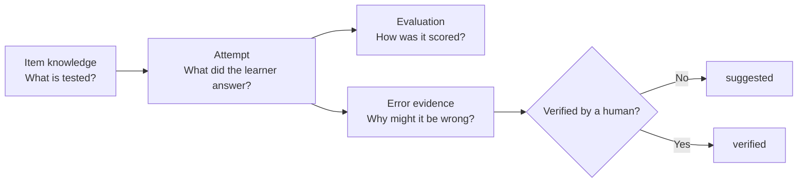
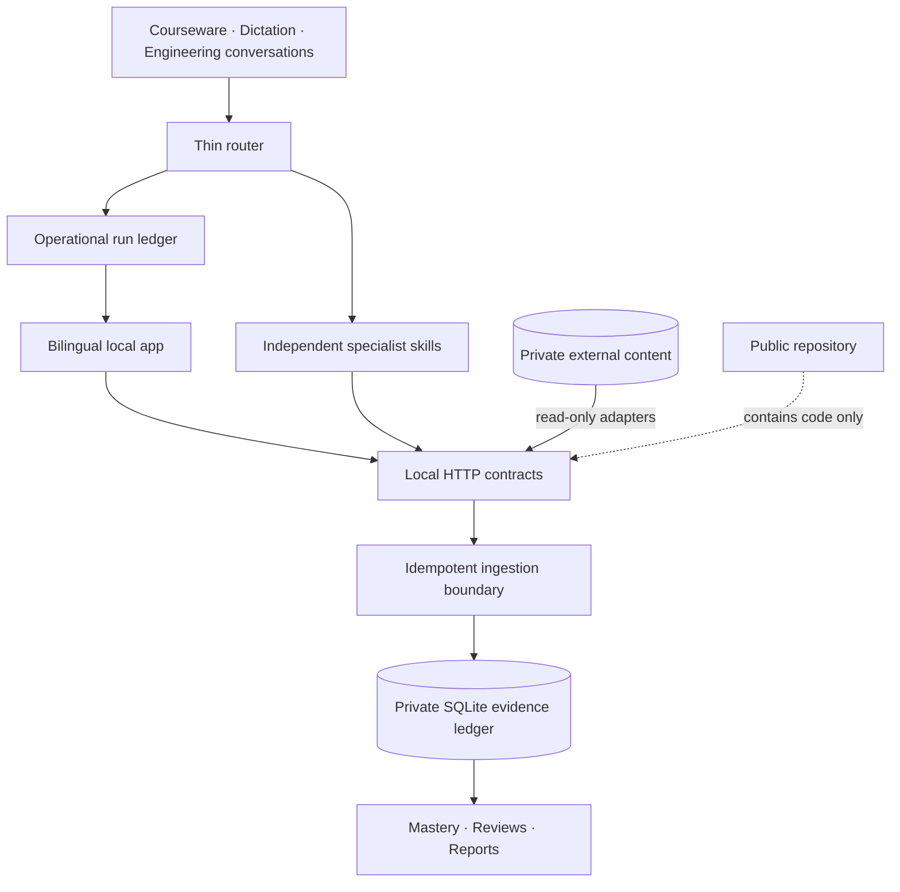

<div align="center">
  
  <p><strong>Local-first learning evidence infrastructure for teachers, learners, and AI agents.</strong></p>
  <p>
    <a href="README.zh-CN.md">中文</a> ·
    <a href="https://wulie0508-gif.github.io/open-tutor-ledger/">Live product tour</a> ·
    <a href="#quick-start">Quick start</a> ·
    <a href="docs/CODEX_FIRST_WORKFLOW.md">Codex-first workflow</a> ·
    <a href="docs/TEACHER_DASHBOARD_ROADMAP.md">Teacher dashboard roadmap</a> ·
    <a href="docs/PRIVACY_BOUNDARY.md">Privacy boundary</a> ·
    <a href="CONTRIBUTING.md">Contributing</a>
  </p>
  <p>
    
    
    
    
    <a href="https://github.com/wulie0508-gif/open-tutor-ledger/actions/workflows/ci.yml"></a>
  </p>
</div>

## Learning tools remember answers. OpenTutor Ledger remembers evidence.

<p align="center">
  <a href="https://wulie0508-gif.github.io/open-tutor-ledger/">
    
  </a>
</p>

> **Public tour, private runtime.** The linked showcase uses manually authored synthetic data and has no connection to a learner database, question bank, or local service. See the [public showcase boundary](docs/PUBLIC_DEMO.md).

OpenTutor Ledger records what a learner attempted, how it was evaluated, which knowledge was involved, and what should be reviewed next. It is a private learning record and orchestration layer that gives teachers, learners, and AI agents one durable answer to five recurring questions:

1. What did this learner actually do?
2. What was tested, and what evidence supports the diagnosis?
3. Which review is due next?
4. How much should this result influence the trend?
5. Can another agent reuse the answer without recomputing everything?

The system stores immutable attempts, revisioned evaluations, sample-aware
mastery, review queues, and auditable agent suggestions in a normalized SQLite
database. The local interface stays intentionally calm: current state, the
smallest next action, and automation health first. Exact weights and evidence
remain one click away.

> **Product boundary:** precise in the back, light in the front. Agents handle
> repetitive clerical work. Humans retain judgment.

## What ships

| Layer | What it does |
| --- | --- |
| Evidence ledger | Immutable item attempts, captured-answer semantics, revisioned grading, and audit history |
| Multi-learner workspaces | Switch learners without mixing sessions, attempts, mastery, or review queues |
| Multi-subject registry | English ships with a specialized adapter; geography, mathematics, Chinese, and science accept generic evidence today |
| Thin agent router | Classifies once, invokes only the required specialist skills, and records progress for the dashboard |
| Specialist skills | Evidence recording, mistake diagnosis, practice selection, courseware context, dictation, and dashboard sync stay independently loadable |
| Evidence-weighted mastery | Controlled offline tests calibrate daily practice without erasing it |
| Knowledge graphs | Hierarchical bilingual concepts and many-to-many item mappings with source, confidence, role, and verification state |
| Deterministic review | Local grading and due queues reduce repeated model calls |
| Bilingual product UI | Switch between 简体中文 and English without changing stored facts |
| Teacher Console | A responsive, accessible, read-only decision surface for priorities, comparable trends, reviews, and evidence gaps |
| Public product tour | A separately deployed, static synthetic showcase with no connection to the private runtime |

## The evidence boundary

OpenTutor Ledger deliberately stores different claims in different places:



- `answer_capture_status=not_captured` never becomes a guessed answer or a fabricated error cause.
- One failed item remains a tentative weak signal until sample size increases.
- Model-created knowledge mappings and diagnoses stay `suggested`.
- Question knowledge describes what an item tests; attempt error evidence describes what happened to one learner.
- Unlike exam totals are never connected as one raw-score trend.

## Agent-native by design

The website is not a second data-entry job. A thin router classifies the request once and returns the smallest ordered specialist chain. Each specialist loads only its own contract, writes through an idempotent API, and appends operational progress to the dashboard. The router does not recompute domain results.

```text
POST /api/agent/route
GET  /api/agent/capabilities
GET  /api/agent/dashboard
POST /api/agent/runs/{run_id}/events
GET  /api/home
GET  /api/teacher/dashboard
GET  /api/context/courseware
GET  /api/context/dictation
POST /api/sessions
POST /api/classroom/attempts
POST /api/dictation/results
GET  /api/reports/weekly
GET  /api/reports/trends
```

Learning evidence and agent-run metadata have separate tables. A dashboard event can never become a score or diagnosis. Every learning write creates a checked backup, runs inside a transaction, and can be replayed safely with the same idempotency key. Agents never need ad hoc SQL access.

## Quick start

### 1. Install

```bash
git clone https://github.com/wulie0508-gif/open-tutor-ledger.git
cd open-tutor-ledger
python -m venv .venv
python -m pip install -e .
powershell -ExecutionPolicy Bypass -File scripts/install_codex_skills.ps1
```

### 2. Create a private runtime outside the repository

PowerShell:

```powershell
$privateRoot = "$env:USERPROFILE\OpenTutorData"
opentutor config set data_dir $privateRoot
opentutor config set db_name "learning.sqlite"
opentutor config set question_bank "$privateRoot\question-bank.sqlite"
opentutor config set library_root "$privateRoot\source-library"
python scripts/create_empty_question_bank.py --output "$privateRoot\question-bank.sqlite"
New-Item -ItemType Directory -Force "$privateRoot\source-library" | Out-Null
opentutor init
opentutor student add --student STU-LOCAL-001 --display-name "Local learner"
opentutor info
opentutor server start --open-browser
```

The empty question-bank shell contains schema only-no exercises. Bring your own licensed or original content through an adapter and keep it outside the repository.

Global `--config` overrides `OPEN_TUTOR_CONFIG`; otherwise OpenTutor discovers `%USERPROFILE%\.opentutor\config.json`. Run `opentutor upgrade` whenever `opentutor info` reports pending migrations. `init` and `upgrade` never create learners.

### 3. Record an anonymous learning event

```powershell
opentutor session import --input examples/session.example.json
opentutor attempts import --input examples/attempts.example.json
opentutor weaknesses report --student STU-LOCAL-001 --days 30
```

## Multi-learner and multi-subject model

Each learner owns sessions, attempts, review state, and reports. Content items belong to a registered subject through `subject_code`. Learners are created explicitly through the CLI; the read-only Teacher Console can switch between existing workspaces without restarting the service.

Specialized adapters may add a subject-specific question bank, knowledge tree, selector, or grader. The generic ledger works without one:

```json
{
  "item": {
    "subject_code": "geography",
    "domain": "knowledge",
    "item_type": "multiple_choice",
    "prompt_snapshot": "Anonymous local prompt",
    "answer_snapshot": "A"
  }
}
```

## English adapter

The bundled English adapter adds:

- grammar knowledge trees and complete-passage coverage matrices;
- weighted greedy set-cover over complete source-checked passages;
- reading test-point and learner error-cause separation;
- deterministic vocabulary dictation and review queues;
- source-library staging, OCR provenance, and teaching-method retrieval;
- weekly reports and separated assessment trends.

No question bank, exam paper, passage, textbook, answer key, audio, or learner record is distributed with this project.

## Architecture



Read [ARCHITECTURE.md](ARCHITECTURE.md) and the [data dictionary](docs/DATA_DICTIONARY.md) for the complete model.

## Privacy release gate

Before publishing:

```bash
python -m unittest discover -s tests -v
python scripts/release_privacy_audit.py
```

The release gate rejects tracked databases, documents, spreadsheets, images, audio, archives, oversized files, private path markers, and known learner identifiers. See [the full boundary](docs/PRIVACY_BOUNDARY.md).

## Project status

The evidence store, multi-learner isolation, subject registry, Chinese/English UI, thin router, independently installable specialist skills, operational run ledger, English analytics, privacy tests, automatic schema upgrades, and backup workflow are implemented. The project is pre-1.0: internet-facing authentication, packaged subject adapters, and an FSRS-compatible scheduler remain future work.

## Contributing

Contributions are welcome-especially generic subject adapters, accessibility improvements, privacy tooling, and evidence-calibration research. Read [CONTRIBUTING.md](CONTRIBUTING.md) first.

## License

Code and original documentation are licensed under the [MIT License](LICENSE). Learner data and third-party educational content are outside the repository and outside this license.
