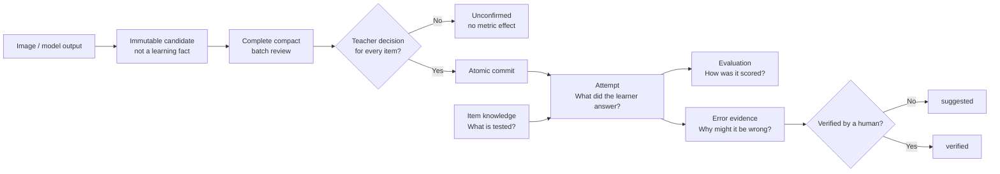
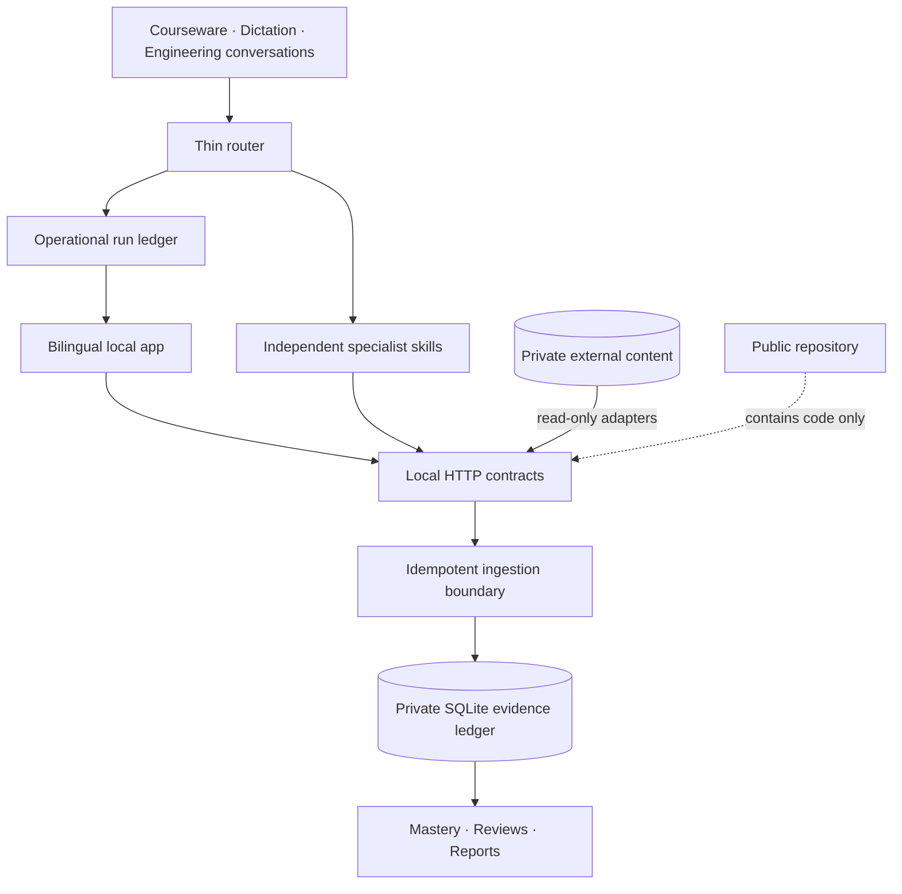

<div align="center">
  
  <p><strong>Evidence OS for agent-native tutoring.</strong></p>
  <p>
    <a href="README.zh-CN.md">中文</a> ·
    <a href="https://wulie0508-gif.github.io/cassian-atlas/">Live product tour</a> ·
    <a href="#quick-start">Quick start</a> ·
    <a href="docs/CODEX_APP.md">Codex app guide</a> ·
    <a href="docs/CODEX_FIRST_WORKFLOW.md">Workflow</a> ·
    <a href="docs/TEACHER_DASHBOARD_ROADMAP.md">Teacher dashboard roadmap</a> ·
    <a href="docs/PRIVACY_BOUNDARY.md">Privacy boundary</a> ·
    <a href="CONTRIBUTING.md">Contributing</a>
  </p>
  <p>
    
    
    
    
    <a href="https://github.com/wulie0508-gif/cassian-atlas/actions/workflows/ci.yml"></a>
  </p>
</div>

## Learning tools remember answers. Cassian Atlas maps the evidence.

> **Map every attempt. Navigate the next lesson.**

<p align="center">
  <a href="https://wulie0508-gif.github.io/cassian-atlas/">
    
  </a>
</p>

> **Public tour, private runtime.** The linked showcase uses manually authored synthetic data and has no connection to a learner database, question bank, or local service. See the [public showcase boundary](docs/PUBLIC_DEMO.md).

Cassian Atlas records what a learner attempted, how it was evaluated, which knowledge was involved, and what should be reviewed next. It is a private learning record and orchestration layer that gives teachers, learners, and AI agents one durable answer to five recurring questions:

1. What did this learner actually do?
2. What was tested, and what evidence supports the diagnosis?
3. Which review is due next?
4. How much should this result influence the trend?
5. Can another agent reuse the answer without recomputing everything?

The system stores immutable attempts, revisioned evaluations, sample-aware
mastery, review queues, and auditable agent suggestions in a normalized SQLite
database. The local interface stays intentionally calm: current state, the
smallest next action, and automation health first. Exact weights and evidence
remain one click away.

> **Product boundary:** precise in the back, light in the front. Agents handle
> repetitive clerical work. Humans retain judgment.

## A Codex-first application bundle

Cassian Atlas packages project policy, a thin router, a bundle of
independently loadable skills, an audited local CLI/API, a private SQLite evidence
ledger, and a read-only Teacher Console. Open the repository as a Codex project,
install the skills once, and let Codex route each request to the smallest
required workflow. The product is local software rather than a hosted SaaS, so
learner records and provider credentials stay under the operator's control.

Read the [Codex application guide](docs/CODEX_APP.md) for the complete bundle,
installation flow, model-extraction boundary, and example prompts.

## What ships

| Layer | What it does |
| --- | --- |
| Evidence ledger | Immutable item attempts, captured-answer semantics, revisioned grading, and audit history |
| Multi-learner workspaces | Switch learners without mixing sessions, attempts, mastery, or review queues |
| Multi-subject registry | English ships with a specialized adapter; geography, mathematics, Chinese, and science accept generic evidence today |
| Thin agent router | Classifies once, invokes only the required specialist skills, and records progress for the dashboard |
| Specialist skills | Evidence recording, mistake diagnosis, practice selection, courseware context, dictation, and dashboard sync stay independently loadable |
| Human-confirmed extraction | Immutable model candidates, compact full-batch review, and an atomic teacher-confirmed commit keep unreviewed transcription out of learning facts |
| Evidence-weighted mastery | Controlled offline tests calibrate daily practice without erasing it |
| Knowledge graphs | Hierarchical bilingual concepts and many-to-many item mappings with source, confidence, role, and verification state |
| Deterministic review | Local grading and due queues reduce repeated model calls |
| Verified question reuse | Source-checked whole-passage selection manifests, duplicate/history exclusions, and a learner-free public explanation cache |
| Operational Base projection | A seven-view whitelist, local outbox, delivery ledger, and readback contract for a Cassian-only Feishu projection; no live transport is bundled |
| Bilingual product UI | Switch between 简体中文 and English without changing stored facts |
| Teacher Console | A responsive, accessible, read-only decision surface for priorities, comparable trends, reviews, and evidence gaps |
| Public product tour | A separately deployed, static synthetic showcase with no connection to the private runtime |

## The evidence boundary

Cassian Atlas deliberately stores different claims in different places:



- `answer_capture_status=not_captured` never becomes a guessed answer or a fabricated error cause.
- Provider results, model agreement, and review prefill are candidates only. Until the whole batch reaches terminal teacher decisions and commits, they cannot affect attempts, mastery, error evidence, or retest scheduling.
- One failed item remains a tentative weak signal until sample size increases.
- Model-created knowledge mappings and diagnoses stay `suggested`.
- Question knowledge describes what an item tests; attempt error evidence describes what happened to one learner.
- Unlike exam totals are never connected as one raw-score trend.

## Codex-first confirmation and reuse contracts

Version 0.5.0 adds a hard boundary between extraction and learning evidence. Every item in an extraction batch appears in the teacher review, including ordinary multiple-choice matches. Silence, a partial review, or model agreement is never acceptance. During the cold-start period, `R1`, `R2`, and `R3` items require successful independent first-round results from exactly Codex and Doubao before a committable teacher decision; the two requests use the same source crop and neither receives the other's output. `R0` deterministic capture may use one provider, while `R4` is manual or explicitly excluded. Translation and writing therefore always carry both candidates, with a visible diff when they disagree.

Provider rows and confirmation revisions are append-only. Review output separates ordinary items from attention items, hides standard answers, and exposes text-level differences. Only a complete terminal batch can cross the single atomic commit into `attempts` and `evaluations`; `not_captured` and `rejected_alignment` remain audited exclusions rather than invented responses.

Cassian Atlas's local CLI/API is a single trusted-operator boundary. Provider labels and teacher actors are append-only provenance claims, not cryptographic proof of a human identity. Keep write endpoints private, use the provider adapter instead of hand-labeling results, and let the confirmation skill submit decisions only after an explicit teacher response; silence or model agreement never authorizes a payload.

The same release adds three supporting boundaries:

- Question selection opens the private bank read-only, accepts only verified real sources, preserves complete passage groups, checks exact/near duplicates plus learner history, and stores an immutable selection/exclusion/coverage manifest.
- Public explanations have deterministic cache identities derived from source, question, answer, knowledge mapping, rubric, policy, and schema hashes. They contain no learner or attempt foreign key, and only `source_checked` or `teacher_confirmed` entries are reusable.
- Feishu Base support is a local operational projection contract only. It stages whitelisted, learner-scoped metrics in an outbox, requires a successful payload-hash readback before updating published state, and accepts only the configured `Cassian Learning Lab | 学习工作室` / `Cassian Learning Ops` target. No live Feishu transport or write is included in this release.

## Agent-native by design

The website is not a second data-entry job. A thin router classifies the request once and returns the smallest ordered specialist chain. Each specialist loads only its own contract, writes through an idempotent API, and appends operational progress to the dashboard. The router does not recompute domain results.

```text
POST /api/agent/route
GET  /api/agent/capabilities
GET  /api/agent/dashboard
POST /api/agent/runs/{run_id}/events
GET  /api/home
GET  /api/teacher/dashboard
GET  /api/context/courseware
GET  /api/context/dictation
POST /api/sessions
POST /api/classroom/attempts
POST /api/dictation/results
POST /api/extraction/batches
POST /api/extraction/batches/{batch_id}/provider-results
GET  /api/extraction/batches/{batch_id}/review
POST /api/extraction/batches/{batch_id}/decisions
POST /api/extraction/batches/{batch_id}/commit
GET  /api/extraction/batches/{batch_id}
GET  /api/reports/weekly
GET  /api/reports/trends
```

Learning evidence and agent-run metadata have separate tables. A dashboard event can never become a score or diagnosis. Every learning write creates a checked backup, runs inside a transaction, and can be replayed safely with the same idempotency key. Agents never need ad hoc SQL access.

## Quick start

### 1. Install

```bash
git clone https://github.com/wulie0508-gif/cassian-atlas.git
cd cassian-atlas
python -m venv .venv
python -m pip install -e .
powershell -ExecutionPolicy Bypass -File scripts/install_codex_skills.ps1
```

### 2. Create a private runtime outside the repository

PowerShell:

```powershell
$privateRoot = "$env:USERPROFILE\CassianAtlasData"
cassian config set data_dir $privateRoot
cassian config set db_name "learning.sqlite"
cassian config set question_bank "$privateRoot\question-bank.sqlite"
cassian config set library_root "$privateRoot\source-library"
python scripts/create_empty_question_bank.py --output "$privateRoot\question-bank.sqlite"
New-Item -ItemType Directory -Force "$privateRoot\source-library" | Out-Null
cassian init
cassian student add --student STU-LOCAL-001 --display-name "Local learner"
cassian info
cassian server start --open-browser
```

The empty question-bank shell contains schema only-no exercises. Bring your own licensed or original content through an adapter and keep it outside the repository.

Global `--config` overrides `OPEN_TUTOR_CONFIG`; otherwise Cassian Atlas discovers the legacy-compatible `%USERPROFILE%\.opentutor\config.json`. New commands should use `cassian`; the former `opentutor` command, `.opentutor` directory, and `OPEN_TUTOR_*` variables remain stable compatibility identifiers. Run `cassian upgrade` when `cassian info` reports pending packaged migrations. A checksum mismatch or unknown applied migration is not an upgrade request: stop and investigate it. `init` and `upgrade` never create learners.

### 3. Record an anonymous learning event

```powershell
cassian session import --input examples/session.example.json
cassian attempts import --input examples/attempts.example.json
cassian weaknesses report --student STU-LOCAL-001 --days 30
```

For teacher-verified answers that were present in an existing scored session but
were previously recorded incorrectly, replace only the named active attempts:

```powershell
cassian attempts replace --student STU-LOCAL-001 --session SES-EXISTING --input '<replacement-payload.json>' --actor teacher --reason 'verified original-answer correction'
```

The replacement command preserves the session and scored item identities,
supersedes the old attempts, rebuilds review tracking, and recalculates the
existing assessment in one transaction. It rejects changed slot maxima and an
assessment whose current totals do not match its active-attempt baseline.

## Multi-learner and multi-subject model

Each learner owns sessions, attempts, review state, and reports. Content items belong to a registered subject through `subject_code`. Learners are created explicitly through the CLI; the read-only Teacher Console can switch between existing workspaces without restarting the service.

Specialized adapters may add a subject-specific question bank, knowledge tree, selector, or grader. The generic ledger works without one:

```json
{
  "item": {
    "subject_code": "geography",
    "domain": "knowledge",
    "item_type": "multiple_choice",
    "prompt_snapshot": "Anonymous local prompt",
    "answer_snapshot": "A"
  }
}
```

## English adapter

The bundled English adapter adds:

- grammar knowledge trees and complete-passage coverage matrices;
- weighted greedy set-cover over complete source-checked passages;
- reading test-point and learner error-cause separation;
- deterministic vocabulary dictation and review queues;
- source-library staging, OCR provenance, and teaching-method retrieval;
- weekly reports and separated assessment trends.

No question bank, exam paper, passage, textbook, answer key, audio, or learner record is distributed with this project.

## Architecture



Read [ARCHITECTURE.md](ARCHITECTURE.md) and the [data dictionary](docs/DATA_DICTIONARY.md) for the complete model.

## Privacy release gate

Before publishing:

```bash
python -m unittest discover -s tests -v
python scripts/release_privacy_audit.py
python scripts/release_privacy_audit.py --history
```

The release gate rejects tracked databases, documents, spreadsheets, images,
audio, archives, credential patterns, oversized files, private path markers,
and known learner identifiers. The second audit also scans every text blob
reachable from local Git refs so a clean current tree cannot conceal unsafe
history. See [the full boundary](docs/PRIVACY_BOUNDARY.md).

## Shanghai English corpus & private RAG integration

The MIT-licensed repository ships software, schemas, workflows, and synthetic
examples only. It does not distribute exam papers, passages, answer keys,
textbooks, learner records, or API credentials.

A separately maintained, provenance-aware index and retrieval corpus is built
for Shanghai English exam materials from the past three years. The exact years,
paper types, question types, and licensable materials are defined in a written
content schedule before delivery. For materials covered by documented rights,
or supplied by customers who are authorized to use them, we can provide private
deployment, RAG integration, knowledge-point retrieval, complete-passage
selection, retesting, and assessment-assembly workflow adaptation.

Commercial licensing and partnerships:
[wulie0508@gmail.com](mailto:wulie0508@gmail.com)

> Coverage, source rights, delivery format, and permitted uses are governed by
> an agreed content schedule and license. The private corpus is not included in
> this repository's MIT License and is never loaded by the public demo. This is
> not an official product of, or partnership with, the Shanghai Municipal
> Educational Examinations Authority, any school, or any publisher.

## Project status

The evidence store, multi-learner isolation, subject registry, Chinese/English UI, thin router, independently installable specialist skills, operational run ledger, teacher-gated extraction, verified selection manifests, public explanation reuse, local Base projection ledger, English analytics, privacy tests, explicit schema upgrades, and backup workflow are implemented. The project is pre-1.0: live Feishu delivery, internet-facing authentication, packaged subject adapters, a persisted extraction-calibration registry, and an FSRS-compatible scheduler remain future work.

## Contributing

Contributions are welcome-especially generic subject adapters, accessibility improvements, privacy tooling, and evidence-calibration research. Read [CONTRIBUTING.md](CONTRIBUTING.md) first.

## License

Code and original documentation are available under the [MIT License](LICENSE).
Cassian Atlas is an independent open-source project by Cassian Learning Lab and is not affiliated
with or endorsed by OpenAI. Third-party educational content and private learner
data are not part of this repository or its license.
