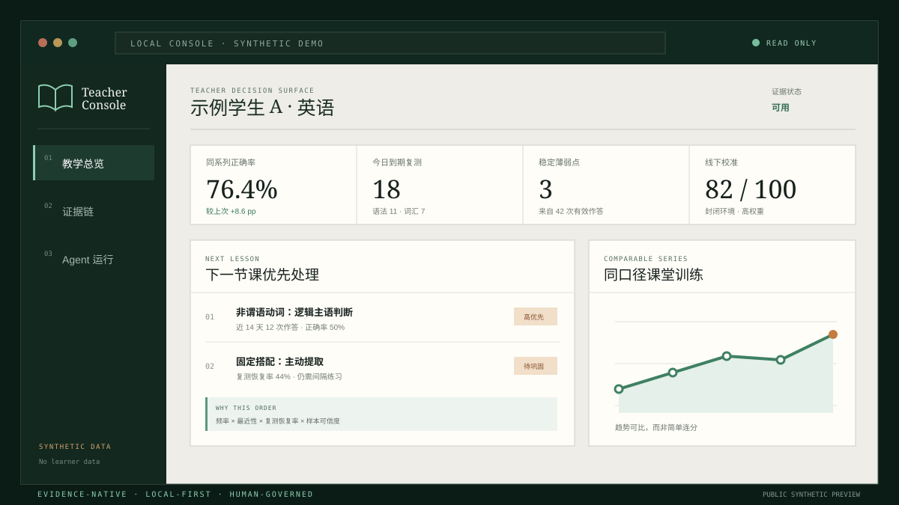

<div align="center">
  
  <p><strong>Evidence OS for agent-native tutoring.</strong><br>面向 Agent 协作教学的学习证据操作系统。</p>
  <p>
    <a href="README.md">English</a> ·
    <a href="https://wulie0508-gif.github.io/cassian-atlas/">公开产品演示</a> ·
    <a href="#快速开始">快速开始</a> ·
    <a href="docs/CODEX_APP.md">Codex 应用说明（英文）</a> ·
    <a href="docs/CODEX_FIRST_WORKFLOW.md">工作流</a> ·
    <a href="docs/TEACHER_DASHBOARD_ROADMAP.md">教师看板路线</a> ·
    <a href="docs/PRIVACY_BOUNDARY.md">隐私边界</a> ·
    <a href="CONTRIBUTING.md">参与贡献</a>
  </p>
</div>

<p align="center">
  <a href="https://wulie0508-gif.github.io/cassian-atlas/">
    
  </a>
</p>

> **公开的是产品演示，私有的是学习运行时。** 展示站全部使用人工编写的合成数据，不连接学生数据库、题库或本机服务。详见[公开展示边界](docs/PUBLIC_DEMO.md)。

---

## 普通学习工具记住答案，Cassian Atlas 绘制证据地图

> **记录每次作答，导航下一节课。**

Cassian Atlas 是一套私有、可审计、面向 Agent 的学习记录与编排系统。它持续回答五个问题：

1. 学生实际上做了什么？
2. 题目考了什么，诊断依据是什么？
3. 接下来应该复测什么？
4. 这条成绩对趋势应该有多大影响？
5. 另一个 Agent 能否直接复用结果，而不是重新计算？

后台保存不可变作答、可修订评分、样本量、知识映射、复测队列与审计证据；前台默认只显示当前状态、最小下一步和自动化是否正常。

> **产品原则：后台精确，前台减负。重复劳动交给 Agent，真正需要判断的事情留给人。**

## 这是一个 Codex-first 应用包

Cassian Atlas 把项目规则、轻量路由、一组可独立加载的 Skill、
经过审计的本地 CLI/API、私有 SQLite 证据账本与只读教师决策台打包在
同一个仓库里。将仓库作为 Codex 项目打开并安装 Skills 后，Codex 会把
任务路由到最小必要工作流。它不是托管 SaaS，真实学习记录与模型凭据
始终由使用者掌控。

完整安装方式、职责边界与示例提示词见 [Codex 应用说明](docs/CODEX_APP.md)。

## 已实现能力

| 能力 | 说明 |
| --- | --- |
| 多学生工作区 | 学生之间的课次、作答、掌握度与复测队列严格隔离 |
| 多学科注册 | 英语具有完整专用适配器；地理、数学、语文、科学已经能记录通用学习证据 |
| 中英双语界面 | 中文与 English 即时切换，不改变底层事实 |
| 教师决策台 | 只读展示下一课优先项、同口径趋势、复测队列和证据缺口 |
| 公开产品演示 | 独立部署的静态合成数据展厅，不连接私有运行时 |
| 轻量中枢路由 | 只判断一次任务类型，只调用必要的专用 Skill，并自动更新看板台账 |
| 独立专用 Skill | 录入证据、错题诊断、算法选题、课件上下文、听写和看板同步可分别加载 |
| 人工确认的识别流程 | 模型输出先保存为候选；只有完整人工确认后才可原子写入学习事实 |
| 证据加权 | 线下封闭测试以更高权重校准日常课堂，但不会覆盖平时成绩 |
| 知识与错因分离 | 题目“考什么”和学生“为什么错”分别建模 |
| 本地确定性流程 | 听写批改、复测排程与统计不必反复消耗模型 token |
| 可追溯选题 | 只使用来源已核验的完整语篇，记录重复排除、历史排除和知识覆盖清单 |
| 运营投影契约 | 本地生成白名单化的飞书 Base 待发送记录；本版本不包含实时云端传输 |
| 隐私开源边界 | 代码可公开，学生数据、题库、教材、OCR、音频和本机路径全部留在仓库外 |

## 证据纪律

- 没有保存原始答案时，记录 `answer_capture_status=not_captured`，不反推具体错因。
- 只有一道错误证据时，只能视为“暂定薄弱点”。
- 模型生成的知识映射和错因只能是 `suggested`，不能自动升级为已核验。
- 不同类型、不同满分的原始成绩不会连成一条误导性趋势线。
- 完整语篇选题不会拆散文章。
- 图片识别与模型一致只代表候选，不代表教师确认，也不会直接生成分数。

## 快速开始

```powershell
git clone https://github.com/wulie0508-gif/cassian-atlas.git
cd cassian-atlas
python -m venv .venv
python -m pip install -e .
powershell -ExecutionPolicy Bypass -File scripts/install_codex_skills.ps1

$privateRoot = "$env:USERPROFILE\CassianAtlasData"
cassian config set data_dir $privateRoot
cassian config set db_name "learning.sqlite"
cassian config set question_bank "$privateRoot\question-bank.sqlite"
cassian config set library_root "$privateRoot\source-library"
python scripts/create_empty_question_bank.py --output "$privateRoot\question-bank.sqlite"
New-Item -ItemType Directory -Force "$privateRoot\source-library" | Out-Null
cassian init
cassian student add --student STU-LOCAL-001 --display-name "本机学生"
cassian info
cassian server start --open-browser
```

空题库只包含结构，不包含任何习题。使用者自行接入有权使用的题库或原创材料，并把它们存放在仓库外。

全局 `--config` 优先于 `OPEN_TUTOR_CONFIG`；如果都没有，Cassian Atlas 自动发现为向后兼容而保留的 `%USERPROFILE%\.opentutor\config.json`。新命令统一使用 `cassian`；原 `opentutor` 命令、`.opentutor` 目录与 `OPEN_TUTOR_*` 环境变量继续作为稳定兼容标识。`cassian info` 显示有待迁移版本时，先执行 `cassian upgrade`。`init` 和 `upgrade` 都不会创建学生。

## Agent 的典型用法

```text
POST /api/agent/route              # 中枢只规划最小 Skill 链
GET  /api/agent/capabilities       # 专用能力清单
GET  /api/agent/dashboard          # 自动化运行台账
POST /api/agent/runs/{id}/events   # 专用 Agent 更新进度
GET  /api/home                    # 最小当前状态
GET  /api/teacher/dashboard       # 教师决策看板（显式学生与学科）
GET  /api/context/courseware      # 课件 Agent 上下文
GET  /api/context/dictation       # 听写 Agent 上下文
POST /api/sessions                # 创建或确认课次
POST /api/classroom/attempts      # 批量写入课堂作答
POST /api/dictation/results       # 本地确定性批改与写入
POST /api/extraction/batches      # 创建待确认的识别批次
GET  /api/extraction/batches/{id}/review  # 完整人工核对
POST /api/extraction/batches/{id}/commit  # 仅完整确认后原子提交
GET  /api/reports/weekly          # 周报
GET  /api/reports/trends          # 分系列趋势
```

网站不是第二套录入工作。正常流程是用户把任务交给中枢，中枢只分发必要的专用 Skill；专用 Agent 调接口完成保存并自动更新看板。网站只负责快速查看与必要的人工确认。运行台账与学习证据分表保存，因此“任务已完成”不会被误算成学生成绩。

## 开源隐私检查

```bash
python -m unittest discover -s tests -v
python scripts/release_privacy_audit.py
python scripts/release_privacy_audit.py --history
```

发布检查会拦截数据库、文档、试卷、表格、图片、音频、压缩包、凭据特征、超大文件、私人路径和已知学生标识；第二条审计还会检查所有本地 Git 引用能够访问的历史文本，避免用“干净的新提交”掩盖旧历史。完整说明见 [隐私边界](docs/PRIVACY_BOUNDARY.md)。

## 上海英语题库与私有 RAG 接入

Cassian Atlas 的 MIT 开源仓库只包含软件、数据结构、工作流与合成
示例，不包含任何试卷、文章、答案、教材、学生记录或 API 凭据。

我们另行维护一套面向近三年上海英语考试资料的结构化索引与来源可追踪
检索切片。具体纳入的年份、卷别、题型及可授权内容，以签约前提供的
资料清单和相应权利范围为准。对于已有明确权利依据，或由客户合法取得
并提供的材料，可提供私有部署、RAG 接入、知识点检索、整篇选题、错题
复测与组卷工作流适配服务。

商业授权与合作：[wulie0508@gmail.com](mailto:wulie0508@gmail.com)

> 具体覆盖范围、资料来源、交付形式与可使用场景，以双方书面确认的
> 资料清单和授权约定为准。相关题库内容不属于本仓库的 MIT License，
> 也不会在公开演示中加载。本项目不是上海市教育考试院、学校或出版社
> 的官方产品，也不暗示任何官方合作或背书。

## 当前边界

当前版本适合本机、单教师或可信局域环境，不提供公网认证。英语适配器已包含知识树、完整语篇覆盖、阅读错因、听写和趋势分析；中枢路由、独立 Skill、人工确认识别、可追溯选题清单、公开解析缓存和本地飞书投影台账已经完成。实时飞书传输、持久化识别校准、多教师公网权限系统与 FSRS 兼容排程仍属于后续方向。

## License

代码与原创文档使用 [MIT License](LICENSE)。学生数据与第三方教育内容从未纳入本仓库，也不属于该许可证授权范围。Cassian Atlas 是 Cassian Learning Lab 的独立开源项目，与 OpenAI 不存在隶属或官方背书关系。
